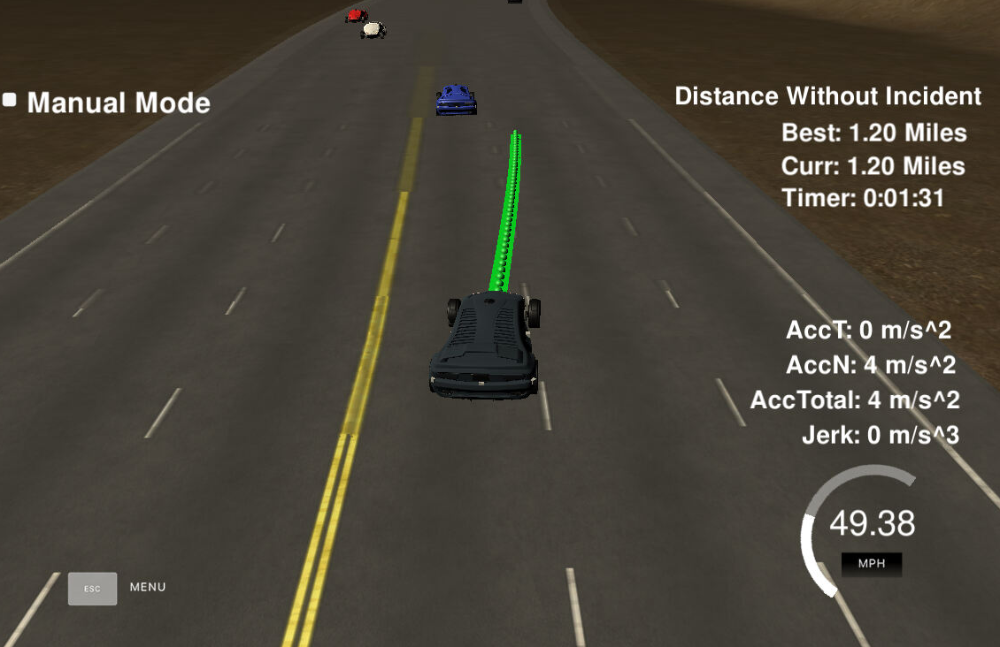
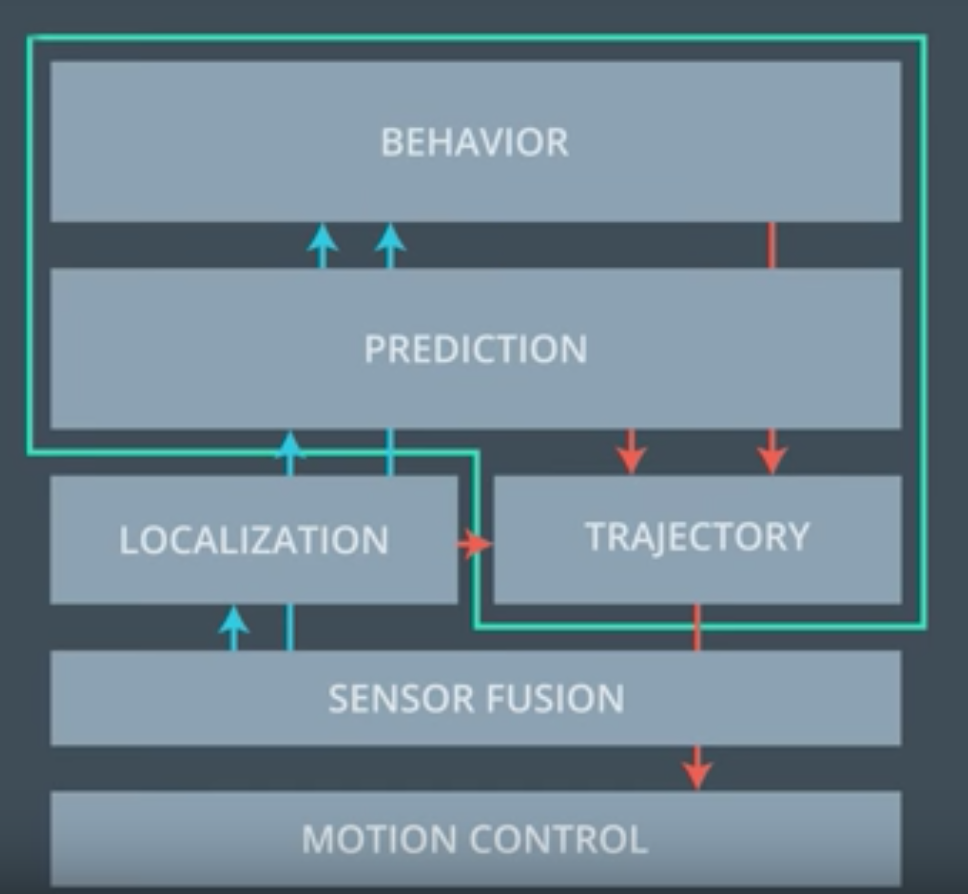

# CarND-Path-Planning-Project
Udacity Self-Driving Car Nanodegree - Path Planning Project



## Path Planning in Self-driving Car


Path planner is a very crucial point for a self-driving car. Once the car knows it is, the next step is to know where it should go next to reach it's goal, this is called path planning.

In general, a path planner has three sub-components: prediction, behaviour planner and trajectory generator.  

As we can see formt he figure hereunder, Prediction step gets it's input from localisation as well as sensor fusion (contains all the needed data about the surroundings, cars, obstacles etc.). 

The result of the prediction a set of likely trajectories for the of the surrounding objects. With these predictions, the Behaviour module decides what can be done next. 
Finally, trajectory generator calculates the path and send the commands to the motion controller of our vechicle. 

<figure>

</figure>


# Overview

In this project, we need to implement a path planning algorithms to drive a car on a highway on a simulator provided by Udacity([the simulator could be downloaded here](https://github.com/udacity/self-driving-car-sim/releases/tag/T3_v1.2)). The simulator sends car telemetry information (car's position and velocity) and sensor fusion information about the rest of the cars in the highway (Ex. car id, velocity, position). It expects a set of points spaced in time at 0.02 seconds representing the car's trajectory. The communication between the simulator and the path planner is done using [WebSocket](https://en.wikipedia.org/wiki/WebSocket). The path planner uses the [uWebSockets](https://github.com/uNetworking/uWebSockets) WebSocket implementation to handle this communication. Udacity provides a seed project to start from on this project ([here](https://github.com/udacity/CarND-Path-Planning-Project)).


### Goal
In this project, our goal is to safely navigate around a virtual highway with other traffic that while driving with 50 MPH speed limit. The car's localization and sensor fusion data are provided along with a sparse map list of waypoints around the highway. 
The car should try to go as fast as possible up to the 50 MPH speed limit, which means passing slower traffic when possible.
The car should avoid hitting other cars. Also, the car should not experience total acceleration over 10 m/s^2 and jerk that is greater than 10 m/s^3.

The actual implementation of the decision and trajectory generation can be very different from situation to situation. Parking lot or urban street driving is very different from highway environment. In this work we will present a simple highway path planner implementation that takes simple decision on a highway route taking into consideration mainly the traffic and speed limitation.


## Implementation


### Behaviour and Trajectory.


To analyze the valid trajectories, and as a consequence the Behaviour, the car should analyze the surroundings and detect one out of two actions:
1. Change speed.
2. Lane shift. 


#### Speed
Here we have one out of three behaviours, Maintain speed, Accelerate or decelerate.
The decision is based on whether there is a car ahead of us or not.

```C++
  if ( car_ahead ) { // Car ahead
    if ( !car_left && lane > 0 ) {
      // if there is no car too close on the left and there is a left lane.
      lane--; // Change lane left.
    } else if ( !car_right && lane != 2 ){
      // if there is no car too close on the right and there is a right lane.
      lane++; // Change lane right.
    } else if ( too_close ){
      // if Car is too close use MAX_ACC to decelerate
      speed_diff -= MAX_ACC;
    } else { // Can't change lane, decrease speed
      speed_diff -= SMOOTH_ACC;
    }
  } else {
  if ( ref_vel < MAX_SPEED ) {
      speed_diff += SMOOTH_ACC;
    }
  }
```

#### Lane shift
 The decision here is based not only on whether there is car ahead of us but, Whether there is a space in the adjacent lane to take a safe lane transition or not, so here the car must check the adjacent lanes and see if there is also a car within this proper safe distance or not and accordingly take the proper action.


```C++
if ( check_car_d > 0 && check_car_d < 4 ) 
 {
   check_car_lane = 0;
 } else if ( check_car_d > 4 && check_car_d < 8  ) {
   check_car_lane = 1;
 } else if ( check_car_d > 8 && check_car_d < 12 ) {
   check_car_lane = 2;
 }
```


 Finally the action is provided by updating the way points accordingly.
 
 
### Path generation

Using fernet coordinates, New way points are generated from the current position and then we update the path for next 90 meters. 

```C++
  // updating waypoints in the future.
  vector<double> next_wp0 = getXY(car_s + 30, 2 + 4*lane, map_waypoints_s, map_waypoints_x, map_waypoints_y);
  vector<double> next_wp1 = getXY(car_s + 60, 2 + 4*lane, map_waypoints_s, map_waypoints_x, map_waypoints_y);
  vector<double> next_wp2 = getXY(car_s + 90, 2 + 4*lane, map_waypoints_s, map_waypoints_x, map_waypoints_y);
```


Afterwards, we convert these coordinates and then extrapolate the waypoints using [spline-library](http://kluge.in-chemnitz.de/opensource/spline/) in the way points.
later on we get back the points that are lying on the spline as the points the car should follow.

```C++
 for(int i=0; i<ptsx.size(); i++){
    double shift_x = ptsx[i] - ref_x;
    double shift_y = ptsy[i] - ref_y;
    ptsx[i] = (shift_x*cos(0-ref_yaw) - shift_y*sin(0-ref_yaw));
    ptsy[i]= (shift_x*sin(0-ref_yaw)+ shift_y*cos(0-ref_yaw));
  }
```

In order to have a smooth transition to the car, we merge between the generated by a spline and append to the previous calculated path points we have previously.

```C++
  for(int i = 0; i < previous_path_x.size(); i++) {
      next_x_vals.push_back(previous_path_x[i]);
      next_y_vals.push_back(previous_path_y[i]);
  }
```


 ### Conculsion

 The car was able to successfully drive the entire track without any incidents. There are several improvements that can be performed in the project. We could make car prefer the left lane change or right lane change by comparing the speed of the car in front of the intented lane. 
 Also, We would like to experiment with jerk minimizing trajectory(JMT).


---


# Project setup


## Source files

- `main.cpp`: Main algorithm of Vehicle's path planning, Communicates with the simulator
- `helpers.h/.cpp`: Helper routines for coordinates conversions etc.
- `spline.h/.cpp`: [spline-library](http://kluge.in-chemnitz.de/opensource/spline/)


## Building and running

### Simulator.
You can download the Term3 Simulator which contains the Path Planning Project from the [releases tab (https://github.com/udacity/self-driving-car-sim/releases).

#### The map of the highway is in data/highway_map.txt
Each waypoint in the list contains  [x,y,s,dx,dy] values. x and y are the waypoint's map coordinate position, the s value is the distance along the road to get to that waypoint in meters, the dx and dy values define the unit normal vector pointing outward of the highway loop.

The highway's waypoints loop around so the frenet s value, distance along the road, goes from 0 to 6945.554.

### Basic Build Instructions

1. Clone this repo.
2. Make a build directory: `mkdir build && cd build`
3. Compile: `cmake .. && make`
4. Run it: `./path_planning`.

## Data and simulator description

Here is the data provided from the Simulator to the C++ Program

#### Main car's localization Data (No Noise)

["x"] The car's x position in map coordinates

["y"] The car's y position in map coordinates

["s"] The car's s position in frenet coordinates

["d"] The car's d position in frenet coordinates

["yaw"] The car's yaw angle in the map

["speed"] The car's speed in MPH

### Previous path data given to the Planner

//Note: Return the previous list but with processed points removed, can be a nice tool to show how far along
the path has processed since last time. 

["previous_path_x"] The previous list of x points previously given to the simulator

["previous_path_y"] The previous list of y points previously given to the simulator

### Previous path's end s and d values 

["end_path_s"] The previous list's last point's frenet s value

["end_path_d"] The previous list's last point's frenet d value

#### Sensor Fusion Data, a list of all other car's attributes on the same side of the road. (No Noise)

["sensor_fusion"] A 2d vector of cars and then that car's [car's unique ID, car's x position in map coordinates, car's y position in map coordinates, car's x velocity in m/s, car's y velocity in m/s, car's s position in frenet coordinates, car's d position in frenet coordinates. 

---

## Dependencies

* cmake >= 3.5
 * All OSes: [click here for installation instructions](https://cmake.org/install/)
* make >= 4.1
  * Linux: make is installed by default on most Linux distros
  * Mac: [install Xcode command line tools to get make](https://developer.apple.com/xcode/features/)
  * Windows: [Click here for installation instructions](http://gnuwin32.sourceforge.net/packages/make.htm)
* gcc/g++ >= 5.4
  * Linux: gcc / g++ is installed by default on most Linux distros
  * Mac: same deal as make - [install Xcode command line tools]((https://developer.apple.com/xcode/features/)
  * Windows: recommend using [MinGW](http://www.mingw.org/)
* [uWebSockets](https://github.com/uWebSockets/uWebSockets)
  * Run either `install-mac.sh` or `install-ubuntu.sh`.
  * If you install from source, checkout to commit `e94b6e1`, i.e.
    ```
    git clone https://github.com/uWebSockets/uWebSockets 
    cd uWebSockets
    git checkout e94b6e1
    ```

